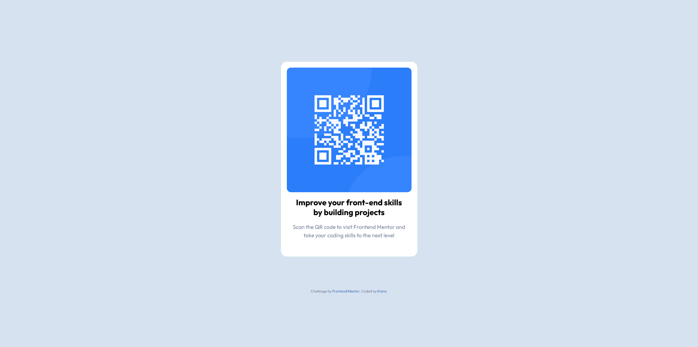

# Frontend Mentor - QR code component solution

This is a solution to the [QR code component challenge on Frontend Mentor](https://www.frontendmentor.io/challenges/qr-code-component-iux_sIO_H). Frontend Mentor challenges help you improve your coding skills by building realistic projects.

## Table of contents

- [Overview](#overview)
  - [Screenshot](#screenshot)
  - [Links](#links)
- [My process](#my-process)
  - [Built with](#built-with)
  - [What I learned](#what-i-learned)
  - [Useful resources](#useful-resources)
- [Author](#author)
- [Acknowledgments](#acknowledgments)

## Overview

### Screenshot

### Links

- Solution URL: [Add solution URL here](https://github.com/AndreeaKiara/QR-component-challenge)
- Live Site URL: [Add live site URL here](https://andreeakiara.github.io/QR-component-challenge/)

## My process

### Built with

- Semantic HTML5 markup
- CSS custom properties
- Flexbox
- CSS Grid

### What I learned

- Basic use of CSS custom properties;
- Basic use of flexbox and grid;

### Useful resources

- [Resource 1](https://www.joshwcomeau.com/css/custom-css-reset/) - This helped me with the CSS reset, which I plan on using at the beginning of my CSS file.

## Author

- Github - [AndreeaKiara](https://github.com/AndreeaKiara)
- Frontend Mentor - [@AndreeaKiara](https://www.frontendmentor.io/profile/AndreeaKiara)

## Acknowledgments

Thank you to Kevin Powell (https://www.youtube.com/@KevinPowell), after watching his tutorial on another challenge I was able to solve this one on my own!
